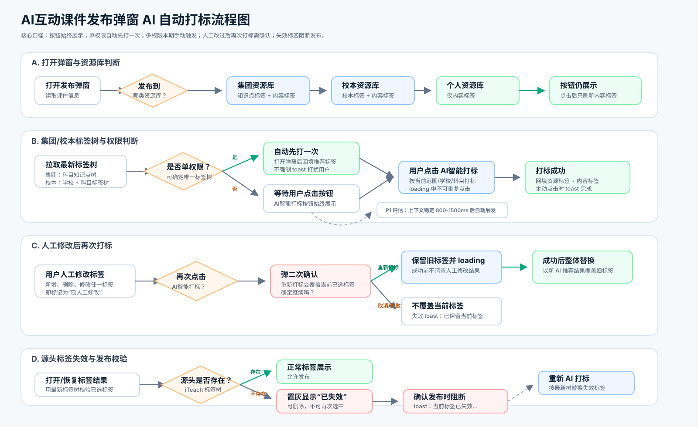
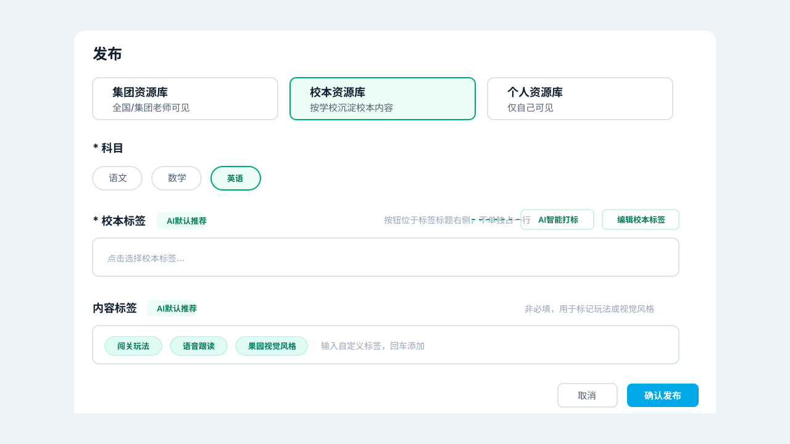

# 【PRD】AI互动课件发布弹窗支持 AI 自动打标

# 修订记录

| 更新时间 | 更新内容 | 更新人 |
| --- | --- | --- |
| 2026-06-15 | 第五版：按最新口径重写。明确多权限、多科目用户也自动打标，系统按每个角色/权限上下文批量生成推荐结果；保留 AI 智能打标按钮用于当前上下文重新打标 | Jolin / Codex |

# 一、项目背景

## 1.1 项目背景

AI互动课件生成后，需要通过发布弹窗沉淀到集团资源库、校本资源库或个人资源库。资源入库时需要完成标签标注，便于后续在 iTeach 资源库中检索、筛选、复用和做学情报告关联。

当前发布弹窗已支持选择发布范围、学校、AI互动课件名称、科目、年级、知识点/校本标签和内容标签。本次需求是在现有发布弹窗内新增 AI 自动打标能力，降低老师和教研员手动选择标签的成本，并提升多角色账号在不同发布上下文之间切换时的标签回显效率。

## 1.2 现状/问题

| 问题 | 说明 | 影响 |
| --- | --- | --- |
| 手动选择知识点/校本标签成本高 | 老师需要从标签树中自己查找匹配标签 | 发布链路变长，容易漏选或错选 |
| 集团标签和校本标签来源不同 | 集团资源库使用集团知识点标签；校本资源库使用校本标签 | 如果不按资源库区分，容易拉错标签树 |
| 校本标签会被分校修改 | 校本标签由集团知识点复制初始化，分校教研员可以修改 | 每次打标都需要拉取最新校本标签树 |
| 多权限账号切换上下文复杂 | 一个用户可能同时有集团权限、多个分校权限、多个科目权限 | 用户在集团/校本/学校/科目之间切换时，需要快速看到对应上下文的标签推荐结果 |
| 用户可能人工改过 AI 结果 | 用户删除、新增、修改标签后，可能又想重新 AI 打标 | 如果直接覆盖，会丢失人工修改 |
| 标签源头可能被删除 | 已选知识点/校本标签可能已被 iTeach 删除 | 如果继续发布，会产生无效标签数据 |
| 内容标签缺少范围定义 | 当前内容标签只知道“玩法、视觉风格”大方向 | AI 输出容易发散，不利于资源检索和运营维护 |

## 1.3 解决方案

**一句话描述方案：**在发布弹窗标签标题右侧始终展示 `AI智能打标` 按钮；系统进入发布链路后，根据用户拥有的角色/权限上下文批量拉取对应标签树并自动打标。用户切换发布范围、学校、科目时，优先展示该上下文已生成的标签结果；若用户人工修改后再次点击 AI 智能打标，需要二次确认；若已选标签在 iTeach 源头被删除，则置灰展示为失效标签并阻断发布。

| 发布范围 | 标签展示 | AI 打标来源 | 自动打标规则 |
| --- | --- | --- | --- |
| 集团资源库 | 知识点标签 + 内容标签 | 当前科目的集团知识点树 + 课件内容 | 按用户拥有的集团科目权限自动生成 |
| 校本资源库 | 校本标签 + 内容标签 | 当前学校 + 当前科目的最新校本标签树 + 课件内容 | 按用户拥有的学校/科目权限自动生成 |
| 个人资源库 | 内容标签 | 课件内容 + 当前科目/年级 | 自动生成内容标签，不拉取知识点树或校本标签树 |

## 1.4 核心规则

| 规则 | 说明 |
| --- | --- |
| 按钮始终展示 | 三类资源库均展示 `AI智能打标` 按钮；集团/校本处理资源标签 + 内容标签，个人只处理内容标签 |
| 单权限自动预打标 | 用户只有 1 条可用标签树权限时，系统自动为该上下文打标；按钮仍保留，可重新打标 |
| 多权限批量预打标 | 用户有多条权限或多个科目时，系统按每个角色/权限上下文分别自动打标 |
| 上下文切换回显 | 用户切换集团/校本、学校、科目后，展示对应上下文的打标结果；若该上下文仍在打标中，则展示打标中状态 |
| 人工修改按上下文保存 | 用户只修改当前上下文的标签，不影响其他上下文的 AI 推荐结果 |
| 重新打标需确认 | 用户人工修改当前上下文标签后，再次点击 AI 打标需二次确认 |
| 成功后替换 | 重新 AI 打标成功后，只替换当前上下文的标签结果 |
| 失败后保留 | AI 打标失败时，不覆盖当前上下文已有标签 |
| 失效标签阻断发布 | 集团/校本标签若在最新标签树中不存在，置灰展示为 `已失效`，确认发布时阻断 |

# 二、需求概览

## 2.1 UI稿地址

产品demo地址：[http://localhost:5173/](http://localhost:5173/)

线上demo地址：[https://coursewareagent.chenjialing.cn/](https://coursewareagent.chenjialing.cn/)

UI稿地址：待提供

## 2.2 产品流程一览

说明：上图为 AI 自动打标旧流程图，本版需要按“多权限批量预打标”口径更新流程图。正式评审前，流程图需补充以下主链路：

| 流程节点 | 新口径 |
| --- | --- |
| 进入发布链路 | 读取课件内容、当前发布默认值、用户全部角色/权限 |
| 枚举打标上下文 | 生成集团科目上下文、校本学校 + 科目上下文、个人内容标签上下文 |
| 批量自动打标 | 每个集团/校本上下文分别拉取对应标签树并生成资源标签；内容标签按上下文生成或复用 |
| 切换上下文 | 展示当前上下文对应结果；未完成展示打标中；失败展示可重试 |
| 人工修改 | 只影响当前上下文 |
| 确认发布 | 只保存用户最终选择的发布范围、学校、科目下的标签结果 |

# 三、需求列表

| 需求模块 | 需求概述 | 优先级 | 备注 |
| --- | --- | --- | --- |
| 1-发布弹窗标签区 | 1-1 三类资源库均展示 AI 智能打标按钮 | P0 | 个人资源库按钮只刷新内容标签 |
| 1-发布弹窗标签区 | 1-2 AI 打标时按钮 loading，完成后 toast 提示 | P0 | 不新增大面积提示面板 |
| 2-标签来源规则 | 2-1 集团资源库按科目拉取集团知识点树 | P0 | 从 iTeach 拉取 |
| 2-标签来源规则 | 2-2 校本资源库按学校 + 科目拉取最新校本标签树 | P0 | 每次打标拉最新树 |
| 2-标签来源规则 | 2-3 个人资源库只生成内容标签 | P0 | 不展示知识点/校本标签 |
| 3-权限逻辑 | 3-1 单权限用户自动预打标 | P0 | 自动回填该上下文标签结果 |
| 3-权限逻辑 | 3-2 多权限用户批量预打标 | P0 | 按每个角色/权限上下文自动生成 |
| 3-权限逻辑 | 3-3 上下文切换回显 | P0 | 切换后展示对应上下文结果或打标中状态 |
| 4-人工修改 | 4-1 当前上下文人工修改状态 | P0 | 人工修改只影响当前上下文 |
| 4-人工修改 | 4-2 人工改过后再次 AI 打标需二次确认 | P0 | 成功覆盖当前上下文，失败保留 |
| 5-失效标签 | 5-1 源头标签被删除后置灰展示并阻断发布 | P0 | 适用于集团/校本标签 |
| 6-内容标签 | 6-1 明确内容标签推荐范围 | P0 | 玩法机制、互动能力、视觉主题、学习活动 |
| 7-结果缓存 | 7-1 按上下文缓存 AI 打标结果 | P0 | 切换上下文时快速回显 |

# 四、需求方案

| 产品原型/流程图 | 具体功能说明 |
| --- | --- |
|  | **1-1 AI自动打标完整流程** * 默认展示：用户点击发布/替换入口后，打开发布弹窗。 * 系统读取：课件名称、课件内容、当前默认发布范围、学校、科目、年级、用户全部角色/权限。 * 系统枚举：所有可用打标上下文。集团上下文按 `集团资源库 + 科目` 生成；校本上下文按 `校本资源库 + 学校 + 科目` 生成；个人上下文按 `个人资源库 + 当前课件内容` 生成。 * 自动触发：系统对所有可用集团/校本上下文批量自动打标。 * 展示逻辑：发布弹窗默认展示当前选中发布范围、学校、科目对应的标签结果。 * 若当前上下文打标完成：展示推荐标签。 * 若当前上下文打标中：标签区保留 loading 状态，按钮文案展示 `AI智能打标中`。 * 若当前上下文打标失败：保留已有标签或空标签，按钮可点击重试。 |
|  | **1-2 发布弹窗标签区展示** * 集团资源库：标签字段标题展示 `知识点标签`，右侧展示 `AI智能打标` 按钮。 * 校本资源库：标签字段标题展示 `校本标签`，右侧展示 `AI智能打标` 和 `编辑校本标签` 按钮。 * 个人资源库：不展示知识点标签/校本标签，仅展示 `内容标签`，内容标签标题右侧展示 `AI智能打标` 按钮。 * 内容标签：非必填，用于标记玩法或视觉风格；支持点击修改、点击删除、输入自定义标签后回车添加。 * 本期不展示：当前标签树、账号权限数量、批量任务数量等技术说明。 |
|  | **1-3 AI智能打标按钮交互** * 默认展示：所有发布范围均展示 `AI智能打标` 按钮。 * 自动打标中：若当前上下文正在自动打标，按钮文案展示 `AI智能打标中`，按钮内展示转圈 loading，按钮不可重复点击。 * 自动打标完成：当前上下文标签自动回填；自动打标完成不强制 toast，避免打扰用户。 * 用户主动点击：对当前上下文重新打标。 * 主动点击成功：toast 提示 `AI智能打标完成~如有问题可人工修改。` * 主动点击失败：不覆盖当前标签，toast 提示 `AI智能打标失败，已保留当前标签，请稍后重试或手动修改。` |
|  | **2-1 集团资源库-知识点标签规则** * 默认展示：发布范围选择 `集团资源库` 时，标签字段名称展示为 `知识点标签`。 * 数据来源：按集团权限对应科目，从 iTeach 拉取集团知识点树。 * AI 推荐范围：AI 只能从当前科目的集团知识点树中推荐标签，不允许生成标签树外的知识点标签。 * 批量预打标：若用户拥有多个集团科目权限，系统分别为每个科目生成知识点标签结果。 * 切换科目后：展示该科目上下文的打标结果；若该科目任务未完成，则展示打标中状态。 * 校验逻辑：点击确认发布时，若知识点标签为空，则 toast 提示 `请选择知识点标签`；若存在失效标签，则 toast 提示 `当前标签已失效，请删除后重新选择标签`。 |
|  | **2-2 校本资源库-校本标签规则** * 默认展示：发布范围选择 `校本资源库` 时，标签字段名称展示为 `校本标签`，并展示 `编辑校本标签` 按钮。 * 数据来源：按学校 + 科目，从 iTeach 拉取该学校最新校本标签树。 * AI 推荐范围：AI 只能从最新校本标签树中推荐标签，不允许生成标签树外的校本标签。 * 批量预打标：若用户拥有多个分校/科目权限，系统分别为每个 `学校 + 科目` 上下文生成校本标签结果。 * 切换学校后：展示当前学校 + 科目的打标结果；若任务未完成，则展示打标中状态。 * 切换科目后：展示当前学校 + 新科目的打标结果；若任务未完成，则展示打标中状态。 * 点击 `编辑校本标签`：同现有逻辑，打开校本标签管理入口；用户管理保存后，再次打标需拉取最新校本标签树。 * 校验逻辑：点击确认发布时，若校本标签为空，则 toast 提示 `请选择校本标签`；若存在失效标签，则 toast 提示 `当前标签已失效，请删除后重新选择标签`。 |
|  | **2-3 个人资源库-内容标签规则** * 默认展示：发布范围选择 `个人资源库` 时，不展示知识点标签或校本标签，仅展示 `内容标签`。 * 按钮展示：内容标签标题右侧展示 `AI智能打标` 按钮。 * 自动打标：系统可在进入发布弹窗后自动生成内容标签。 * 点击后：AI 只根据课件名称、课件内容、科目、年级推荐内容标签，不拉取知识点树或校本标签树。 * 切换后：若用户从集团资源库或校本资源库切换到个人资源库，不清空当前内容标签；若已有个人内容标签结果，则直接回显。 * 校验逻辑：点击确认发布时，不校验知识点/校本标签；内容标签为空也允许发布。 |
|  | **3-1 单权限用户自动预打标** * 触发条件：当用户只有 1 条可用标签树权限，系统能确定唯一集团/校本标签树。 * 默认展示：用户打开发布弹窗后，系统自动拉取对应标签树并推荐资源标签和内容标签。 * 示例1：用户仅为数学科目的集团教研员，系统自动拉取数学集团知识点树并推荐知识点标签和内容标签。 * 示例2：用户仅为北京学校数学教研员，系统自动拉取北京学校数学校本标签树并推荐校本标签和内容标签。 * 按钮保留：自动预打标后，仍展示 `AI智能打标` 按钮，用户可点击重新打标。 |
|  | **3-2 多权限用户批量预打标** * 触发条件：当用户拥有多条集团/校本/学校/科目权限时，系统进入发布链路后自动批量打标。 * 批量范围：用户拥有的每个角色/权限上下文都需要生成一份打标结果。 * 示例：用户同时拥有集团英语、广州学校英语、北京学校数学权限，则系统分别生成集团英语知识点标签、广州学校英语校本标签、北京学校数学校本标签。 * 默认展示：弹窗仍按当前默认发布范围、学校、科目展示对应上下文结果。 * 任务状态：每个上下文独立维护打标中、成功、失败、人工修改状态。 * 部分失败：若某个上下文打标失败，不影响其他上下文结果展示和发布。 * 手动重试：用户切换到失败上下文后，可点击 `AI智能打标` 重新打当前上下文。 |
|  | **3-3 上下文切换回显** * 上下文定义：发布范围 + 学校 + 科目 + 标签树来源。集团资源库不包含学校；个人资源库不包含标签树。 * 切换发布范围后：系统展示新发布范围对应上下文结果。 * 切换学校后：系统展示新学校 + 当前科目的校本标签结果。 * 切换科目后：系统展示当前发布范围下新科目的标签结果。 * 若对应上下文已成功：直接回显标签。 * 若对应上下文打标中：展示 `AI智能打标中`，保留当前输入操作能力。 * 若对应上下文失败：保留空标签或上一次有效标签，用户可点击按钮重试。 * 若用户切回已人工修改上下文：展示用户人工修改后的结果，不自动覆盖。 |
|  | **4-1 人工修改后再次 AI 打标** * 人工修改定义：用户新增、删除、修改任一知识点标签、校本标签或内容标签，均视为当前上下文已人工修改。 * 作用范围：人工修改状态只作用于当前上下文，不影响其他角色/权限上下文。 * 再次点击：若当前上下文已人工修改，再次点击 `AI智能打标`，需先弹二次确认。 * 二次确认位置：浮层展示在 `AI智能打标` 按钮上方，尖角指向按钮。 * 二次确认文案：`重新打标会覆盖当前已选标签，确定继续吗？` * 二次确认按钮：`取消`、`重新打标`，其中 `重新打标` 使用红色强调色。 * 点击取消后：关闭二次确认浮层，不执行 AI 打标，保留当前标签。 * 点击重新打标后：进入按钮 loading；loading 期间先保留当前标签，不提前清空。 * 打标成功后：用新的 AI 推荐结果整体替换当前上下文标签。 * 打标失败后：保留当前人工修改结果，toast 提示 `AI智能打标失败，已保留当前标签，请稍后重试或手动修改。` |
|  | **5-1 源头标签被删除后的失效标签规则** * 触发时机：打开发布弹窗、批量预打标完成、恢复缓存、切换发布范围/学校/科目、点击确认发布前，均需用最新标签树校验已选知识点/校本标签。 * 若源头仍存在：标签正常展示，允许发布。 * 若源头不存在：标签仍展示在已选区，展示原标签名称，置灰，并追加 `已失效`。 * 失效标签操作：用户可以删除失效标签；失效标签不可在下拉树中再次选中。 * 删除后：若用户删除失效标签，不再自动恢复该失效标签。 * 重新打标：用户点击 AI智能打标后，系统按最新标签树重新推荐；若新结果不包含失效标签，则自动移除失效标签。 * 发布校验：若集团/校本标签中仍存在失效标签，点击确认发布时阻断，toast 提示 `当前标签已失效，请删除后重新选择标签`。 * 内容标签：内容标签不依赖 iTeach 标签树，不存在源头删除导致的失效状态。 |
|  | **6-1 内容标签推荐范围** * 内容标签定位：用于描述课件内容形态，不替代知识点标签或校本标签。 * 推荐数量：默认推荐 3-5 个短标签。 * 推荐维度：玩法机制、互动能力、视觉主题、学习活动。 * 本期不做：课堂用途类标签暂不纳入内容标签范围，避免和运营分类混淆。 * 示例标签：`闯关玩法`、`语音跟读`、`果园视觉风格`、`配对玩法`、`拼写练习`、`颜色认知`、`数感练习`。 * 示例规则：若课件包含关卡/挑战/通关逻辑，可推荐 `闯关玩法`；若课件包含跟读、朗读、口语或语音评测，可推荐 `语音跟读`；若课件主场景为果园、水果、Fruit Garden，可推荐 `果园视觉风格`。 |

# 五、数据口径需求

## 5.1 打标上下文口径

| 上下文类型 | 组成 | 是否拉标签树 | AI 生成内容 |
| --- | --- | --- | --- |
| 集团上下文 | 集团资源库 + 科目 + 用户集团权限 | 是，拉集团知识点树 | 知识点标签 + 内容标签 |
| 校本上下文 | 校本资源库 + 学校 + 科目 + 用户校本权限 | 是，拉最新校本标签树 | 校本标签 + 内容标签 |
| 个人上下文 | 个人资源库 + 当前课件 | 否 | 内容标签 |

## 5.2 标签来源口径

| 标签类型 | 什么时候拉取/生成 | 拉取依据 | 使用规则 |
| --- | --- | --- | --- |
| 集团知识点标签 | 批量预打标、当前上下文重新打标、发布前校验 | 科目 | AI 只能从当前科目知识点树中选择 |
| 校本标签 | 批量预打标、当前上下文重新打标、发布前校验 | 学校 + 科目 | 每次打标和校验均拉取最新校本标签树 |
| 内容标签 | 批量预打标或当前上下文重新打标 | 课件名称、课件内容、科目、年级、互动结构 | 可由 AI 生成，也可由用户人工修改 |

## 5.3 结果缓存口径

| 缓存内容 | 缓存粒度 | 使用场景 | 注意 |
| --- | --- | --- | --- |
| 知识点/校本标签推荐结果 | 当前课件 + 发布范围 + 学校 + 科目 + 权限上下文 | 用户切换上下文时恢复 | 恢复前必须用最新标签树校验，找不到的展示为失效标签 |
| 内容标签推荐结果 | 当前课件 + 发布范围 + 学校 + 科目 + 权限上下文 | 用户切换上下文时恢复 | 个人资源库内容标签不依赖标签树 |
| 打标任务状态 | 当前课件 + 权限上下文 | 展示打标中、成功、失败、可重试 | 各上下文互不影响 |
| 人工修改状态 | 当前课件 + 权限上下文 | 判断再次 AI 打标是否需要二次确认 | 用户任意新增、删除、修改标签后置为已人工修改 |

## 5.4 发布保存口径

点击确认发布时，只保存用户最终选择的发布上下文下的标签结果：

| 发布范围 | 保存内容 | 发布前校验 |
| --- | --- | --- |
| 集团资源库 | 课件基础信息、科目、年级、知识点标签、内容标签 | 知识点标签非空，且不存在失效标签 |
| 校本资源库 | 课件基础信息、学校、科目、年级、校本标签、内容标签 | 校本标签非空，且不存在失效标签 |
| 个人资源库 | 课件基础信息、科目、年级、内容标签 | 不校验知识点/校本标签，内容标签为空也允许发布 |

# 六、待确认问题/本期不做范围

## 6.1 待确认问题

| 问题 | 建议方案 | 影响 |
| --- | --- | --- |
| 批量预打标是在点击发布前触发，还是打开发布弹窗后触发 | 建议打开发布弹窗后立即触发；如果后续性能允许，再前置到点击发布前 | 影响用户等待感和实现复杂度 |
| 多权限批量打标是否需要限制并发数 | 建议研发控制并发，但产品不因成本限制取消批量打标 | 影响接口压力和前端状态管理 |
| 内容标签是否按上下文生成多份 | 建议本期按上下文保存，但同一课件内容可默认复用第一份内容标签 | 影响切换科目时内容标签是否变化 |
| 校本标签管理保存后是否自动刷新当前弹窗标签树 | 建议本期点击 AI 打标或发布前校验时重新拉最新树，不做实时刷新 | 降低本期复杂度 |
| 内容标签是否需要统一运营后台维护词库 | 建议本期先由 AI 推荐 + 用户自定义，后续再做词库治理 | 影响后续检索一致性 |
| 个人资源库是否未来也需要知识点标签 | 建议本期不做，后续如学情报告需要再评估 | 影响个人资源报告能力 |

## 6.2 本期不做范围

| 不做项 | 说明 |
| --- | --- |
| 不做独立 AI 打标弹窗 | 本期只在标签标题右侧展示按钮，不新增二级打标弹窗 |
| 不做大面积权限说明面板 | 不展示当前标签树、账号权限数量、批量任务数量等技术信息 |
| 不做内容标签运营词库后台 | 本期仅定义推荐范围和前端编辑能力 |
| 不做课堂用途内容标签 | 本期内容标签先聚焦玩法、互动能力、视觉主题、学习活动 |
| 不做埋点需求 | 如需埋点，单独补充埋点需求文档 |
| 不做真实接口协议细化 | 本 PRD 写产品口径，接口字段由研发联调时确认 |

# 七、验收标准

| 场景 | 操作 | 预期结果 |
| --- | --- | --- |
| 集团资源库按钮展示 | 选择集团资源库 | 知识点标签标题右侧展示 `AI智能打标` |
| 校本资源库按钮展示 | 选择校本资源库 | 校本标签标题右侧展示 `AI智能打标` 和 `编辑校本标签` |
| 个人资源库按钮展示 | 选择个人资源库 | 内容标签标题右侧展示 `AI智能打标` |
| 单权限自动预打标 | 单权限用户打开发布弹窗 | 系统自动回填推荐标签，且按钮仍保留 |
| 多权限批量预打标 | 多权限用户打开发布弹窗 | 系统为每个角色/权限上下文自动生成打标结果 |
| 多权限切换到已完成上下文 | 用户切换集团/校本、学校或科目 | 展示该上下文对应标签结果 |
| 多权限切换到打标中上下文 | 用户切换到仍在打标的上下文 | 按钮展示 `AI智能打标中`，不可重复点击 |
| 多权限切换到失败上下文 | 用户切换到打标失败的上下文 | 保留已有标签或空标签，按钮可点击重试 |
| 当前上下文重新打标 | 用户点击 AI智能打标 | 仅重新打当前上下文，不影响其他上下文 |
| 打标 loading | 点击 AI智能打标或当前上下文自动打标中 | 按钮文案变为 `AI智能打标中`，按钮内转圈，不可重复点击 |
| 主动打标完成 | 用户主动点击后 AI 打标成功 | toast提示 `AI智能打标完成~如有问题可人工修改。` |
| 人工修改后二次打标-取消 | 人工修改标签后点击 AI智能打标，再点取消 | 不执行打标，保留当前上下文标签 |
| 人工修改后二次打标-确认成功 | 人工修改标签后点击 AI智能打标，再点重新打标 | 打标成功后用新 AI 推荐结果整体替换当前上下文标签 |
| 人工修改后二次打标-失败 | 人工修改标签后确认重新打标，但 AI 打标失败 | 保留当前人工修改结果，并 toast 提示失败 |
| 源头标签失效展示 | 已选标签在最新 iTeach 标签树中不存在 | 标签展示原名称，置灰展示，并追加 `已失效` |
| 源头标签失效删除 | 用户点击失效标签的删除按钮 | 删除该失效标签，删除后不再自动恢复 |
| 源头标签失效发布 | 存在失效知识点/校本标签时点击确认发布 | 阻断发布，toast提示 `当前标签已失效，请删除后重新选择标签` |
| 个人资源库展示 | 从校本资源库切换到个人资源库 | 隐藏校本标签；内容标签不清空 |
| 发布校验 | 集团/校本标签为空时点击确认发布 | 分别 toast 提示 `请选择知识点标签` / `请选择校本标签` |
