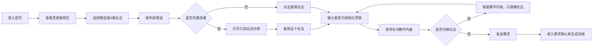

# 【PRD】AI互动课件首页改版：接入灵感助手（评审版）

# 修订记录

| 版本 | 日期 | 修改人 | 修改内容 |
| --- | --- | --- | --- |
| v5.1 | 2026-06-16 | Codex | 按 Jolin PRD 规范更新：灵感推荐区分类改为 creative-shrimp-suite-v1.0 action/INDEX.md 真实 8 类；首页玩法池收口为 40 条正式模板；明确套用玩法、只读示例、年龄筛选和数据来源。 |

# 一、项目背景

## 1.1 项目背景

AI互动课件首页是老师生成互动课件的主入口。老师常见输入是“水果单词”“20以内口算”“拼音听辨”这类短需求，但短需求无法稳定表达互动玩法、课堂流程、反馈规则和视觉要求。

桌面已有本地能力包：`/Users/jolin/Desktop/creative-shrimp-suite-v1.0`。其中 `templates-ready/action/INDEX.md` 已整理出一批可复用的课堂动作玩法模板。6月25日版本需要把这部分能力产品化为首页「灵感推荐区」，让老师先选玩法，再补自己的教学内容生成新课件。

## 1.2 现状/问题

| 问题 | 当前表现 | 用户影响 |
| --- | --- | --- |
| 首页分类容易像资源库 | 如果按语文/数学/英语分类，老师会以为是在找成品课件 | 和“一键同款”区分度不够 |
| 卡片字段来源不清楚 | 短说明、标签、流程看起来像临时编写 | 评审时难解释数据依据 |
| 只看提示词不直观 | 老师还要想象课堂效果 | 套用意愿弱 |
| 套用后不知道填哪里 | 普通输入框承载长 prompt，教学内容不突出 | 老师容易不知道要补什么 |

## 1.3 解决方案

本期采用“真实玩法分类 + 玩法卡片 + 只读示例 + 结构化套用”的方案：

1. 首页灵感推荐区按 action/INDEX.md 的真实 8 类展示玩法。
2. 首页默认展示“精选”，不是正式分类，只是优先推荐池。
3. 每张卡片展示轻量信息，帮助老师快速判断课堂玩法。
4. 点击“看玩法示例”打开真实 HTML 只读示例。
5. 点击“套用玩法”后，输入框进入结构化草稿：老师填写教学内容，系统自动带入真实玩法 prompt。
6. 切换玩法时保留老师填写的教学内容，只替换玩法。

## 1.4 本期范围

| 范围 | 本期是否做 | 说明 |
| --- | --- | --- |
| 首页灵感推荐区 | 是 | 精选 + 8类 action 玩法 |
| 40条正式玩法入库 | 是 | 严格来自 action/INDEX.md |
| 看玩法示例 | 是 | 每条玩法都有示例入口，部分共用代表性 HTML |
| 结构化套用玩法 | 是 | 教学内容高亮输入、真实 prompt 折叠预览 |
| 切换玩法保留内容 | 是 | 保留老师填写内容，只替换玩法块 |
| 首页风格模块 | 否 | 首页不放风格选择，避免和玩法混淆 |
| 未登记 action 文件 | 否 | 不进入 P0 首页，后续单独评估 |
| 复杂推荐算法 | 否 | P0 使用 priority + 分类/年龄筛选 |

# 二、需求概览

## 2.1 UI稿地址

产品demo地址：[http://127.0.0.1:5173/](http://127.0.0.1:5173/)

UI稿地址：待提供

## 2.2 产品流程一览

# 三、需求列表

| 需求编号 | 需求名称 | 优先级 | 说明 |
| --- | --- | --- | --- |
| 1-1 | 灵感推荐区分类改造 | P0 | 分类改为精选 + action真实8类 |
| 1-2 | 年龄筛选改造 | P0 | 全部年龄、6-10岁、10-14岁 |
| 1-3 | 玩法卡片展示 | P0 | 每屏8张，卡片信息轻量 |
| 1-4 | 看玩法示例弹层 | P0 | 全局只读 HTML 示例 |
| 1-5 | 套用玩法结构化输入框 | P0 | 教学内容主输入 + 玩法摘要 + prompt预览 |
| 1-6 | 切换玩法保留教学内容 | P0 | 不覆盖老师已输入内容 |
| 2-1 | 玩法数据入库 | P0 | 40条正式模板、最高版本 prompt |
| 2-2 | 数据说明和研发口径 | P0 | 研发无需阅读创意虾原始文档 |
| 3-1 | 异常与降级 | P1 | 无结果、示例失败、prompt缺失兜底 |

# 四、需求方案

| 产品原型 | 具体功能说明 |
| --- | --- |
| 当前 demo：首页灵感推荐区 | **1-1 灵感推荐区分类改造** * 默认展示：模块标题“灵感推荐区”，右侧一行说明“不知道怎么设计互动课件时，可以来这找找灵感”。 * 分类展示：精选、跳跃障碍类、竞速赛跑类、捉迷藏伪装类、团队协作类、生存竞技类、对战推理类、限时解谜类、淘汰晋级类。 * “精选”是默认推荐池，不是真实分类；其他8类来自 `templates-ready/action/INDEX.md`。 * 不展示玩法总数，不展示内部来源，不展示多行介绍。 |
| 当前 demo：年龄筛选 | **1-2 年龄筛选改造** * 默认选中：全部年龄。 * 可选项：全部年龄、6-10岁、10-14岁。 * 年龄筛选依据：模板文件名中的年龄范围。 * 不展示“低龄启蒙/1-2年级/3-4年级/5-6年级”，因为本批 action 数据无法稳定支撑。 * 分类和年龄筛选样式保持一致，点击后只有选中底色变化，不出现黑色描边。 |
| 当前 demo：玩法卡片 | **1-3 玩法卡片展示** * 桌面端每屏展示8张，4列×2行。 * 卡片展示：年龄+玩法类型、玩法名、一句话说明、课堂流程前4步、最多3个标签、看玩法示例、套用玩法。 * 卡片字段来源：玩法名、学科、知识点、年龄来自 INDEX/文件名；短说明、流程、可替换内容由产品基于 action 分类机制整理。 * 不展示：+1、换题面、批量关卡、换风格、内部来源、长 prompt。 |
| 当前 demo：看玩法示例 | **1-4 看玩法示例弹层** * 点击后打开全局弹层，侧边栏和灵感助手在下层。 * 左侧展示只读 HTML，不提供下载、打开、编辑、一键同款。 * 右侧展示：示例说明、这个玩法适合、课堂流程、可以怎么改成你的课。 * 文案使用老师视角，不出现“兜底映射、同类复用、替换字段”等产研表达。 * 点击“套用这个玩法”后关闭弹层，并回填结构化输入框。 |
| 当前 demo：结构化输入框 | **1-5 套用玩法结构化输入框** * 套用后，输入框切换为结构化草稿。 * 顶部“教学内容”为主要填写区域，老师可以点击、输入、换行。 * 下方展示已套用玩法摘要：玩法名、玩法类型、适用年龄、课堂流程、可替换内容。 * “生成提示词预览”默认折叠，展开后展示真实 `templatePrompt`，并进行 markdown 渲染。 * 发送后走正常需求确认/生成流程。 |
| 当前 demo：切换玩法 | **1-6 切换玩法保留教学内容** * 老师已填写教学内容后，再套用其他玩法，必须保留教学内容。 * 只替换 `<已套用玩法>...</已套用玩法>` 内的玩法信息和真实 prompt。 * 不重复叠加多个玩法块。 * 当前卡片显示“已套用”。 |

# 五、数据口径需求

## 5.1 数据文件

| 文件 | 路径 | 用途 |
| --- | --- | --- |
| 种子 JSON | `docs/灵感推荐区_研发可直接入库种子数据_v1.json` | 研发直接入库或转前端静态数据 |
| 数据说明 | `docs/灵感推荐区_研发可直接入库种子数据说明_v1.md` | 产品/研发/测试核对字段来源 |
| 原始索引 | `/Users/jolin/Desktop/creative-shrimp-suite-v1.0/workspace/GAME-VAULT/templates-ready/action/INDEX.md` | 内部追溯，不展示给用户 |

## 5.2 分类与数量

| 分类 | 数量 | 核心机制 |
| --- | ---: | --- |
| 跳跃障碍类 | 6 | 跳跃障碍 + 落地答题 |
| 竞速赛跑类 | 6 | 答对加速 + 答错减速 |
| 捉迷藏伪装类 | 6 | 寻找伪装的知识元素 |
| 团队协作类 | 4 | 多人协作答题 |
| 生存竞技类 | 4 | 答对生存 + 答错复习 |
| 对战推理类 | 4 | 答题对战 + 逻辑推理 |
| 限时解谜类 | 6 | 限时完成知识拼装 |
| 淘汰晋级类 | 4 | 多轮晋级，末位淘汰 |

## 5.3 数据规则

1. 首页玩法池严格取 INDEX 中 40 条正式模板。
2. 同模板存在多个版本时，取最高版本 markdown 全文作为 `templatePrompt`。
3. 卡片短说明、流程、标签只用于帮助老师理解，不替代真实 `templatePrompt`。
4. 用户侧不展示 `sourceRefs` 和内部目录。
5. 目录里未进入 INDEX 的文件不进入 P0 首页。

# 六、待确认问题/本期不做范围

| 项目 | 结论 |
| --- | --- |
| 是否按学科分类 | 本期不做。首页按 action 玩法机制分类。 |
| 是否纳入 04-make-a-word 等额外文件 | 本期不做。未进入 INDEX 的文件后续单独评估。 |
| 是否每条玩法都做独立真实 HTML | 本期不做。P0 先用代表性示例覆盖，后续逐步补齐。 |
| 是否做个性化推荐算法 | 本期不做。P0 使用 priority、分类、年龄筛选。 |
| 是否首页展示画面风格 | 本期不做。风格入口放在确认卡和生成后课件卡。 |
