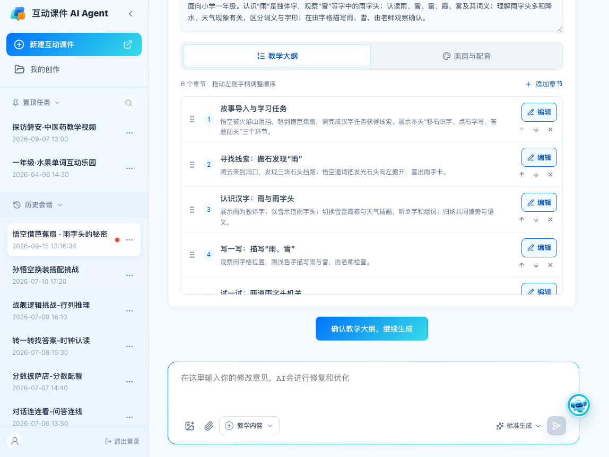
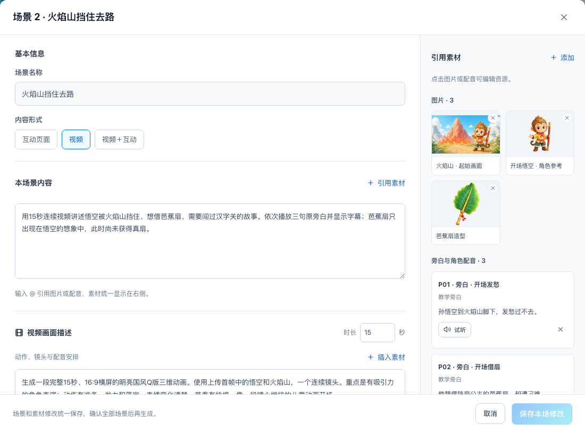
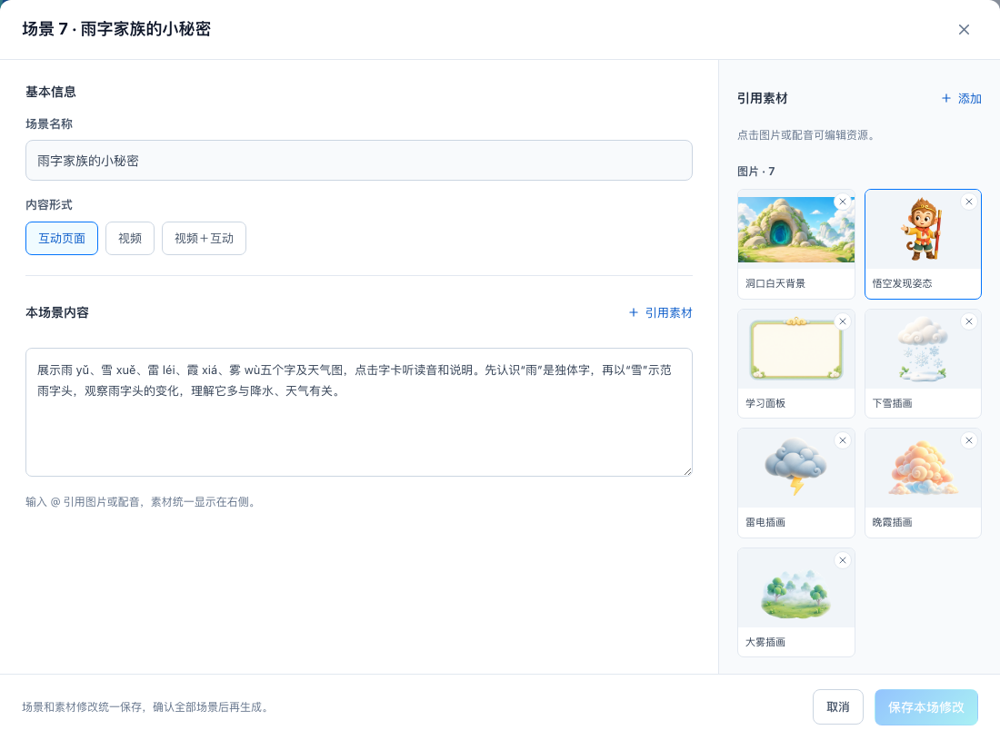

# V33 真实资源同步与大纲拖动排序

2026-09-15，已落实在 `codex/wukong-video-h5-agent-demo`，服务 `http://127.0.0.1:4186/`。沿用旧版产品视觉与已确认流程；4187 停用分支保持原样。

## 体验

从 [悟空示例入口](http://127.0.0.1:4186/wukong-demo) 新建并发送需求。既有任务和已交付版本保留原数据，刷新不会覆盖历史方案。

- 大纲六章来自资源包《第一关真实教学大纲》。左侧手柄可拖动；靠近列表上下边缘自动滚动；上移/下移仍可用，手柄支持键盘上下键。
- 排序保存到任务，刷新后保留；后续场景按新的章节顺序规划。取消拖动不会改变顺序，章节编辑时禁止拖动，确认后的大纲只读。
- 每场仍在一个大弹窗中修改内容、视频描述、图片与配音。点击素材进入同一个弹窗内的资源编辑。
- 交付仍为一张卡，按教学顺序逐场开放“预览 / 修改”，并显示纯视频、纯互动、视频＋互动的进度。

## 真实内容与场景映射

| 教学章节 | 产品场景 |
| --- | --- |
| 故事导入与学习任务 | 封面、15 秒故事开场、闯关任务 |
| 寻找线索：搬石发现“雨” | 腾云到洞口、搬石邀请与操作、发现雨字 |
| 认识汉字：雨与雨字头 | 认读雨雪雷霞雾、字形与天气插画 |
| 写一写：描写“雨、雪” | 描写与老师确认 |
| 试一试：两道雨字头机关 | 两道真实题目、选项与反馈 |
| 线索到手：本关总结 | 获得雨字线索、成功回顾 |

资源包的 13 个场景中，第 05 场“搬石邀请”和第 06 场“搬石互动”属于当前产品的一场视频＋互动页面。保留 12 场交付：纯视频 2、纯互动 7、视频＋互动 3。没有扩展未制作的关卡，也没有增加自动书写评分等能力。

本场景内容根据包内真实页面与说明整理为老师能直接编辑的描述；生产片段编号、文件名等留在视频提示词与核验记录中。章节名称与主要内容直接取自真实大纲。

## 资源与提示词

来源：`V33_按场景资源包_20260915` 解压目录。导入前校验清单中的全部 77 个资源；对 91 个运行素材、真实生成输入、场景截图逐个核对 SHA-256。

编辑素材共 60 项：28 张图片（20 张实际页面素材＋8 张真实生视频输入）、26 条语音、6 条实际使用的视频。视频与音频文件原本已与包内一致，复用现有文件；补齐遗漏的页面素材关联、参考图片、完整提示词与搬石时看向左侧的新悟空图。

- 封面关联实际底图、独立悟空和原录音，不再套用通用悟空主形象。
- 学习页关联四张真实天气插画、学习面板和对应语音。第二题反馈复用的教学语音保留真实关联。
- 开场使用更新后的 15 秒成片及最终生成提示词，保留实际首帧、悟空和扇子参考。
- 腾云到洞口使用实际 17.784 秒连续成片，提示词包括 T01、S02、S03 三个源片段。T01 尾帧仅标注为腾云段参考，不伪装成整条成片尾帧；未留存的 S02/S03 输入不虚构。
- 环境视频按包内真实使用位置关联，作为场景依赖保留，不额外增加教学场景或独立交付卡。
- 现有视频已含原配音。未修改时继续播放成片原声，不重复叠加 MP3 或拆轨 M4A。
- 封面原录音没有留存逐字台词、原始提示词和 VoiceID：可试听、上传替换，配音文本留空。包内建议重生成文案不作为原台词填入。随后用户确认封面录音归为孙悟空，产品据此合入该角色声音分组。按成品重建的图片提示词保留相应记录状态。

源视频分段备份、拆轨音频、完整时间轴、音效、字体和播放器按钮装饰不新增为用户需要确认或编辑的生成任务。运行课件继续使用必要的原播放器素材。

## 历史课件与单场修改

没有修改原始资源包、`index.html` 或 `lesson-v4.html`。`lesson-v5.html` 仅对带本资源版本参数的新任务切换搬石悟空；旧版本保持原姿态。

保存上一版示例数据基准；新任务携带真实内容基准。由此避免真实内容更新被误判为用户修改、把既有 H5 替换为通用页面，或在旧视频上重复播放配音。成品单场草稿、候选、采用为新版本、共享素材局部修改与历史快照规则保持不变。

## 验证

- 77 个素材与预览地址均返回 HTTP 200。
- 资源/数据检查 13 项通过：六章与 12 场映射、音视频关联、真实时长、完整提示词、缺失原文处理、历史基准、原声播放。
- 浏览器全流程 17 项通过：新建、大纲拖动与刷新、原位编辑、场景统一弹窗、真实素材、完整交付、旧新播放器区分，无页面异常。
- 拖动边界检查 3 项通过：边缘自动滚动并从首章移到末章、取消手势不落库、996px 宽度无横向溢出。
- 单场编辑事务 7 项、成品单场修订 21 项、运行时场景隔离 6 项回归通过。共享素材回归改用真实共享的洞口素材，开场专用参考图不再被误当成全课共用图。
- 构建通过；限定范围 lint 未引入新诊断，项目已有的 21 条诊断未增加。

[导入与哈希记录](wukong-v33-package-import.json) · [数据检查](wukong-package-check.json) · [浏览器记录](reviews/20260915-v33-package/checks.json) · [拖动边界记录](reviews/20260915-v33-package/drag-checks.json)





## 复核命令

```sh
python3 scripts/import-wukong-v33-package.py '/实际资源包解压目录/V33_按场景资源包_20260915'
node scripts/check-wukong-package.mjs
node scripts/check-wukong-package-browser.mjs
node scripts/check-outline-drag-browser.mjs
node scripts/check-scene-edit-transaction.mjs
node scripts/check-scene-revision.mjs
node scripts/check-scene-runtime-scope.mjs
npm run build
node scripts/check-video-platform-lint.mjs
```

导入脚本校验已存在文件；遇到字节不一致会停止，不覆盖原文件。生成服务的接入状态没有因为这次真实示例同步而改变。
