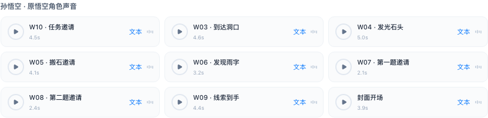

# 封面配音归组与素材引用交互

2026-09-15，4186 旧版分支。

## 本次修正

- 按用户确认，将封面录音归为孙悟空角色声音，名称简化为“封面开场”。已有保存任务也按此规则展示，不再多出一组“用户提供的录音”。原音频不替换；原始逐字台词和 VoiceID 未留存的事实保持不变。
- 在本场景内容或视频描述中输入 `@`，素材选择列表就在该文本框下方展开，右侧继续保留本场素材。点击“引用素材 / 插入素材”也能打开同一入口。
- 可切换图片/配音、搜索，点击“插入”或按回车选择；上下键切换候选。选中后在原光标或选区位置插入 `@素材名称`，恢复输入焦点到引用之后，并显示插入反馈。
- 正文中的素材引用在下方提供可点击入口，继续沿用同一个大弹窗中的资源编辑。视频保留既有引用素材入口。
- Escape 或关闭选择器不会写入正文；保存场景才提交修改，取消场景仍保留原方案。

## 验证

浏览器 16 项通过，包括新旧任务配音归组、选择器位置与侧栏保留、搜索与回车插入、光标续写、图片编辑入口、Escape、保存、视频配音选区替换、取消、跨场景引用与无结果状态；未出现页面异常。资源数据 13 项和编辑事务 7 项通过。构建通过，范围 lint 未新增诊断。

[浏览器检查](reviews/20260915-scene-mentions/checks.json)

