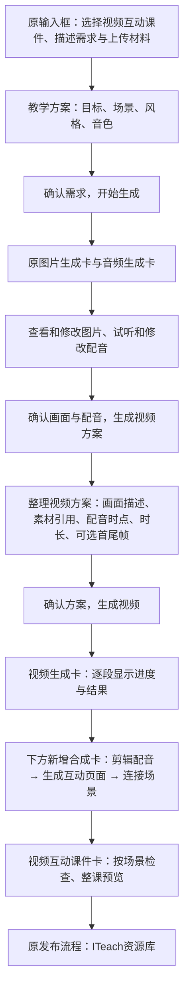

# 视频互动课件：素材确认到整课交付的流程复核

2026-09-14｜本方案已获用户确认并实施。以下保留实施前的判断与范围；当前结果见 [素材确认与视频规划：实现与验证](素材确认与视频规划_实现与验证.md)。评审基于 `940e77e`、HyperVideo 体验报告及悟空原始制作用料。

同日补充：根据用户提供的 HyperVideo 截图，修正输入框偏好入口、视频内图片引用和配音定位。**参考素材独立于首尾帧；配音必须绑定使用位置和用途。** 下文为修订后的建议。

## 1. 判断与推荐流程

这轮涉及确认节点、生成记录和最终交付，属于中等范围的流程调整，已经超出样式微调。可以继续复用原平台组件、会话和发布流程，不需要重做平台。排序若要真实影响生成后的播放，还需要补齐场景顺序与播放器的连接，不能只做拖动效果。

建议采用以下流程。三个确认点分别决定教学内容、素材版本、视频制作方案，不要求老师逐项打勾或逐镜头确认。

- 图片和配音完成后必须停在素材确认处，不能自动规划视频。老师选择“确认画面与配音，生成视频方案”后，再出现视频方案及准备进度。
- 视频方案默认由系统填写；老师可以直接确认，需要精修时再修改对应片段。先从已确认素材中引用角色、场景、道具和配音；有新构图需求才显示准备过程，完成后明确其用途是普通画面参考还是首尾帧。不要求先为每段视频生成一对首尾帧。
- 视频全部完成后自动合成，不再增加一次必点的“开始合成”。合成卡独立出现在视频卡下方，不替换视频卡标题，也不跳回上方。
- 部分视频失败时保留成功片段，并停在视频卡重试；合成失败只重试合成，避免连带重生素材。
- 原型用短时加载演示耗时过程；继续使用本地示例素材，不把它描述为已接入真实模型。

## 2. 六条批注的处理建议

### 输入框与教学方案的设置分工

**视频模式的输入框不再展示“画面风格”“课件音色”两个独立选择器；在教学方案中集中确认。** 输入阶段保留课件形式、需求、上传材料及教学内容入口。普通 H5 模式沿用原设置。

原因：角色和台词在需求输入时还不完整，单一“课件音色”容易让老师误以为同时控制旁白和所有角色。方案形成后再显示风格、旁白音色和各角色音色，设置对象才明确。

系统仍应提供默认值，不能把字段清空等老师填写。自然语言需求中的明确偏好、视频草稿已保存的选择要带入方案；没有指定时智能匹配。切换课件形式不丢失各自草稿，也不把普通 H5 的单一音色自动分配给所有视频角色。

### 原批注处理

| 批注 | 建议及原因 |
| --- | --- |
| 教学方案太长，是否横向 Tab | 采用“教学流程 / 画面风格 / 配音设置”三个 Tab，沿用平台现有页签样式。教学目标在上方保持可见，默认展示教学流程。流程用紧凑列表，详情按需展开。只换 Tab 而保留长列表，仍不能解决阅读负担 |
| 场景拖动排序 | 增加明确的拖动手柄、拖动占位和放置反馈，保留上下移动用于键盘操作。按稳定场景编号保存顺序，联动后续视频规划、最终场景卡和新版本播放顺序；已存在的分支引用不能按数组位置乱换 |
| 编辑资源不明显，素材应先确认 | 图片卡和音频卡各自提供明显的“修改图片 / 修改配音”入口，分别打开相应编辑页签。两张卡下方保留唯一主按钮“确认画面与配音，生成视频方案”，全部完成后可点。无需在末尾找一个泛化的“编辑资源”按钮 |
| 首尾帧用实际素材，且都可选 | 首帧、尾帧并排显示；均可不设置、清除或更换。独立提供“参考素材”，允许从之前生成的图片中选择角色、背景、道具等并说明用途。角色、石头、徽章可以是中间画面的参考，不自动变成首尾帧；两类选择器不能混为一谈 |
| “画面与人物动作”不懂 | 去掉独立的重复编辑框。把动作、镜头运动、人物表演统一写在常显的“视频生成描述”中，并说明“描述这段视频里发生什么、人物怎样动作、镜头怎样变化”。教学用途从已确认方案继承，作为简短说明展示 |
| 视频生成描述不默认收起 | 在视频方案编辑弹窗中直接展开文本框。画面、声音和时长是结构化设置；编辑这些设置时保留老师已经改过的描述，不能像当前代码一样重新拼接并覆盖。明显的时长冲突单独提示处理 |

这里的 Tab 是同一张教学方案卡的内容分类，不替代生成流程，也不额外增加一组全局步骤导航。

### 视频方案编辑弹窗的顺序

1. **片段名称、所属教学场景、总时长**。
2. **视频内容**：默认展开生成描述，按必要的时间段交代画面与动作；支持在描述里 `@` 引用图片或音频，也提供“插入素材”按钮，不要求老师学会输入语法。连续镜头可以只有一段，不强制拆成多个分镜。
3. **本段参考素材**：展示已经引用的缩略图、名称、用途和使用范围；支持添加、更换、移除。只在选素材时打开素材库，不能默认把全部图片铺满页面。
4. **配音安排**：逐条说明谁说什么、从第几秒开始、对应哪段画面，以及使用哪份音频；支持试听、更换、调整时间和修改台词后重新配音。
5. **首帧（选填）｜尾帧（选填）**：在“首尾画面”中并排显示，未设置时显示“未设置”。它们约束起止构图，不替代角色、道具和场景参考。
6. **播放结束后**：继承教学方案中的下一场景、停留等待操作等规则。与生成描述分开，避免把 H5 交互写成让视频模型绘制的内容。

内容描述、引用素材列表、配音安排是同一份规划的不同展示，不是三份独立填写的数据。选择素材后自动插入引用；点引用可预览/更换；更换后相关描述引用和下方列表同步更新，保留用户写的其他文字。

### 图片参考与首尾帧的区别

| 内容 | 解决的问题 | 我方交互 |
| --- | --- | --- |
| 角色 / IP 参考 | 整段或特定分镜里是谁，长什么样 | 引用已生成的角色图片，标明作用于整段或指定画面段落 |
| 背景 / 道具参考 | 场景、物品应是什么造型，可以在视频中间才出现 | 引用素材并描述用途与出现时机；不要求它一定出现在首帧 |
| 风格 / 构图参考 | 参考哪种视觉表达或画面布局 | 明确参考用途，避免把图中所有物体都视为必须生成的内容 |
| 首帧 / 尾帧 | 视频开始或结束时采用什么构图 | 分别选填；与“本段参考素材”独立保存和展示 |
| 独立互动素材 | 学生实际点击、拖动、描写的文字和道具 | 保留为 H5 内容；可为画面一致性提供参考，但不能因此把真实互动烘焙进视频 |

同一张图片可以承担不同用途，必须明确选择的用途。平台表达的是创作要求，实际提交要适配具体服务；不能假定所有模型都允许“多图参考＋参考音频＋首尾帧”任意组合，更不能在提交时默默丢掉引用。

### 配音要能定位和替换

“视频中的配音”不能只是勾选若干文件后累加时长。建议默认呈现简单的配音清单，例如下面的 15 秒视频规划示意；实际位置由所选音频长度重新计算：

| 画面段落 | 配音安排 | 引用音频与操作 |
| --- | --- | --- |
| 0—5 秒：角色看到障碍 | 旁白，第 0.2 秒开始，约 4.4 秒；播放这段已有录音 | 配音 1：显示台词；试听 / 更换 / 调整时间 |
| 5—10 秒：角色想到办法 | 旁白，第 5 秒开始，约 4.6 秒；播放这段已有录音 | 配音 2：显示台词；试听 / 更换 / 调整时间 |
| 10—15 秒：角色准备出发 | 旁白，第 10 秒开始，约 4.4 秒；播放这段已有录音 | 配音 3：显示台词；试听 / 更换 / 调整时间 |

- 每条关联具体画面段落和时间，可使用原音频的一段；录音文件时长、在视频中播放的位置和用途都要区分。
- “更换”从本课已有音频中选择，也允许上传；默认只替换当前引用。需要改变某个角色全课音色时，明确进入全课声音设置，不悄悄替换其他镜头。
- 修改台词或音色后先试听新音频，采用后再更新受影响的时长和视频方案。只改播放位置不重新生成配音。重排后检查越界、意外重叠和遗漏，不静默加速或截断人声。
- 区分**“使用这段配音”**与**“参考这个声音”**：前者表示成品确实播放已确认的录音，后者表示模型参考声音生成新音频，不能承诺与原录音逐字逐秒一致。默认采用老师已经确认的配音，旁白通常由合成环节对齐，角色台词还需处理说话表演与声音同步。
- 背景音乐、环境音与角色对白分别管理；不能用一个“视频声音”开关替代来源说明，也不能把模型生成的人声与原配音叠成双声。
- 互动中的读题、答对反馈等绑定“进入场景 / 点击 / 答题结果”等事件，不硬塞进固定的视频秒数中。

HyperVideo 截图和既有体验记录都体现了“场内分镜＋素材引用＋按分镜指定音频＋可选首尾帧”。应借鉴这种关联关系；将长段制作文字转成老师能快速查看的素材引用和配音行，不照搬黑色界面或要求老师手写全部参数。

### 当前模型能力核对

2026-09-14 核对官方资料：Seedance 2.0 说明支持文字、图片、音频、视频输入与多模态参考；Kling 的元素库区分角色、道具、场景，支持在描述中引用，并在部分模式中结合首尾帧使用。因此平台不能将图片引用能力收窄为首尾帧。这里核对的是公开产品能力，不代表当前原型已经接入相应 API，也不代表所有模式可以任意混用输入。[Seedance 官方介绍](https://seed.bytedance.com/en/seedance2_0)、[Kling 官方元素库指南](https://kling.ai/quickstart/klingai-element-library-3-user-guide)。

## 3. 最终交付卡应展示什么

**视频片段数量与教学场景数量不是同一个概念。** 当前悟空示例有 12 个教学场景、6 个视频素材：其中 5 个场景包含叙事或人物视频，另有一段洞口环境视频用于场内组合。最终不能只把 6 段 MP4 排成列表就当作课件。

最终卡建议：

- 卡头：课件名称、版本、场景总数，以及“预览整课”“发布”原有操作。
- 卡内按教学顺序展示场景：序号、名称、类型（视频 / 视频＋互动 / 互动页面）、实际生成后的缩略图。
- 选择场景后可“预览这一场”，需要修改时定位到该场景的资源或互动设置。
- 默认紧凑展示，完整预览继续使用现有预览区域。最终卡不重复展示全部配音、提示词和素材生成清单。

合成过程卡放在视频卡与最终课件卡之间：

| 卡片 | 生成中 | 完成后 |
| --- | --- | --- |
| 视频生成卡 | 显示已完成片段数，每段可单独查看 | 保留视频结果，不变成合成进度 |
| 合成互动课件卡 | 剪辑与配音对齐、制作互动页面、连接场景与操作反馈 | 收成简短完成记录 |
| 视频互动课件卡 | 合成完成前不提前出现 | 按场景检查和整课预览，进入原发布路径 |

沿用 HyperVideo 研究里“教学环节 → 场景 → 场内视频”的区分；不要求老师维护制作人员使用的完整镜头时间轴。

## 4. 改动范围与需要补齐的逻辑

| 范围 | 当前事实 | 本轮拟调整 |
| --- | --- | --- |
| 展示，局部 | 教学方案垂直堆叠，场景用箭头移动；首帧选择器显示所有图片 | 卡内 Tab、紧凑列表、拖动手柄、分开的素材编辑入口、并排可选首尾帧、常显描述 |
| 视频输入，局部 | 与普通 H5 一样展示风格和音色选择器 | 视频模式隐藏两项，统一在方案中确认；保留已保存偏好，普通 H5 不改 |
| 视频规划，中等 | `VideoShot` 只有首尾帧编号和音频编号列表，没有图片引用用途、分镜使用范围或配音时点 | 增加素材引用及用途、画面段落和音频时间安排；同步引用与描述、更换行为、依赖版本和冲突校验 |
| 流程，中等 | 素材完成后自动调用视频规划；`assets-review` 同时承载两种确认含义 | 分开素材待确认、视频方案准备、视频方案待确认；保存分别确认的素材与方案版本 |
| 生成记录，中等 | 视频和合成复用同一张过程卡；恢复记录仅区分素材与生产 | 独立保存视频方案、视频生成、合成记录；刷新和重新生成后仍按时间顺序向下显示 |
| 最终结果，中等 | 结果卡是普通课件卡；支持单场跳转，但还没有场景列表 | 给视频课件结果增加场景目录，复用现有预览、版本和发布操作 |
| 排序与播放，需要联动 | 现有调序只修改 `segments`；播放器适配目前没有传入这份场景顺序 | 新生成版本使用同一份场景顺序；顺序变化时检查教学前置条件和交互跳转，不能只改列表动画 |

主要涉及视频工作流、方案编辑、素材引用与配音安排、状态与消息恢复、结果卡和播放器适配。视频输入框仅调整两项偏好入口的展示；图片/音频原组件、普通 H5 生成路径和发布表单继续复用。补充的素材引用和配音时点属于视频规划本身，需要一并实现，不是再加一张素材列表即可。此处只调整生成平台原型；已交付的独立悟空原件、历史课件 HTML 和已发布版本不批量改写。新顺序和资源修改在新生成版本中体现。

### 修改后的确认如何失效

- **素材确认前修改**：保留已完成素材，等老师集中确认后再规划视频。
- **素材确认后修改图片或配音**：相关素材重新待确认；确认后仅更新依赖它的视频方案，未受影响镜头保留。
- **只改视频描述、素材引用、首尾帧、配音位置或秒数**：视频方案重新待确认，不回到整课素材生成。只改变独立旁白的混音位置通常只影响合成；改变用于生成口型/动作的音频，则检查视频是否需要重做。
- **只改独立 H5 文字、按钮或道具布局**：更新互动页面与合成，不默认重生视频。
- **已生成后排序**：复用仍有效的视频素材，重做场景编排与必要合成；涉及教学依赖或衔接变化的场景单独提示。

## 5. 悟空首尾帧核对结果

当前 `opening`、`arrival` 的原型图片来自成片抽帧；原型代码也把所有图片作为候选。原始制作用料中已有对应的上传图片，应使用这些实际制作参考，并限定到对应镜头。

| 镜头 | 已找到的制作参考 |
| --- | --- |
| 开场 | `开场整段15秒_V22/01-首帧.png`；该包明确说明不锁尾帧 |
| 腾云到洞口 | `视频融合升级_V17/T01_点击出发_腾云到洞口/首帧.png`、`尾帧.png` |
| 任务邀请、搬石邀请 | `悟空说话镜头重生成_V30` 对应目录的 `01-上传首帧.png`；有素材映射记录 |
| 线索到手 | V32 清单引用 `结尾视频首尾帧 2/E01-首帧.png`，应按正式清单匹配 |

接入时按镜头映射和哈希核对，不拿其他历史版本的相似图片充数；没有使用尾帧的片段保持未设置。以上是悟空示例数据，不进入平台通用配置文案。

## 6. 实施后的验收重点

1. 三个确认点能独立停留；任何前置条件不满足时不能越级生成。
2. 首尾帧都空、仅首帧、仅尾帧、首尾都有均可保存；候选不混入无关道具。
3. 更改秒数或配音不覆盖用户手写描述；音频长于画面时明确提示。
4. 视频完成后合成卡出现在下方；失败、暂停、刷新、局部重生不打乱历史记录。
5. 拖动后的方案顺序、最终场景卡和新版本播放一致；交互前置条件与分支正确。
6. 最终可按场景检查，也可整课体验；发布仍进入原表单。普通 H5 和历史课件继续可用。
7. 视频输入框只在方案中设置风格和各角色音色；自然语言偏好、已有草稿值保留，普通 H5 入口不变。
8. 没有首尾帧时仍可引用角色、背景和中途出现的道具；添加/替换引用同步到描述及列表，不夹带未选择的图片。
9. 配音能追溯到对应分镜、播放时点和录音版本；更换后重算相关安排，原音频播放与音色参考含义明确；互动事件音频不会被误编排到固定视频时间轴。

## 核对依据

- 当前实现：[工作流](../src/components/VideoCourseware/workflow.ts)、[教学方案与素材卡](../src/components/VideoCourseware/VideoWorkflowCard.tsx)、[视频方案编辑](../src/components/VideoCourseware/VideoPlanReview.tsx)、[规划校验](../src/data/videoCourseware/planning.ts)、[播放器适配](../src/components/VideoCourseware/runtime.ts)。
- [HyperVideo 体验报告，第 3.4 节](../../../04-用户与竞品分析/20260912-HyperVideo产品体验/HyperVideo生产流程体验与现有Agent改造结论_v2.md)：教学环节、场景、分镜的关系及原平台组装方式。
- [悟空完整共创复盘](../../../01-需求文档/AI教学视频生成需求/20260913-悟空共创复盘/小学视频互动课件共创复盘与生成偏好配置指南_v1.0.md)：素材分工、实际音长、局部修改与教师负担。
- [原素材目录](../../../03-AI互动课件制作/0302%20【制作中】精品课件/悟空借芭蕉扇-视频互动识字/)：V22 生成说明、V17 首尾帧、V30 素材映射和 V32 视频清单。

本轮用户反馈优先于上一轮评审中“一次合并确认”和“完整描述按需展开”的建议。当前运行版及此前验证结果仍以[上一轮实现记录](视频方案确认与生成卡复用_实现与验证.md)为准，本文件不是完成声明。
