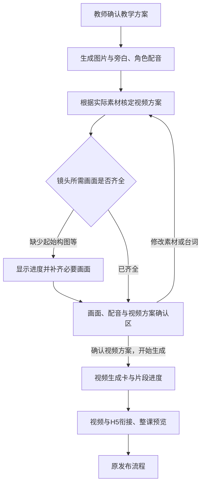

# 视频方案确认与生成卡复用：实施前评审

状态：以下保留实施前评审口径。用户确认后已实施，当前状态见[实现与验证](视频方案确认与生成卡复用_实现与验证.md)。

## 结论

图片、音频生成卡可以复用原平台的视觉与预览交互，同时保留视频课件的素材确认门槛。卡片负责展示，视频流程负责决定何时允许继续。直接套入整个普通 H5 生成流程，或只替换卡片却漏掉真实素材、试听和确认操作，才会造成流程变化。

当前确实缺少“根据当前素材核定视频制作方案”的步骤。建议扩充现有生成前确认区：图片与配音完成后，Agent 自动整理每个视频镜头的画面、声音、时长、生成描述和互动衔接；老师在同一处检查并整体确认，再开始生成视频。无需另开工作台，也不要求逐镜头逐个确认。

## 当前代码核对

| 发现 | 代码依据 | 影响 |
| --- | --- | --- |
| 原图片、音频卡接收阶段进度、展开和重试回调，本身不启动视频 | `ImageGenerationPanelV2.tsx`、`AudioGenerationPanel.tsx` 的 Props 和实现 | 可以把外观复用与流程控制分开 |
| 原图片卡内置固定图片，原音频卡内置固定音频且播放为计时动画 | 两个组件中的 `MOCK_IMAGES`、`MOCK_AUDIOS` 和 `togglePlay` | 接入时必须支持本课素材数据和真实音频播放，不能原样替换 |
| 图片与音频完成后停在 `assets-review`，不会自动生成视频 | `workflow.ts` 的 `advanceVideoJobs` | 这道等待教师确认的门槛应保留 |
| 当前“画面与配音确认，生成视频”直接调用 `start(project.id, 'video')` | `VideoWorkflowCard.tsx` 的 `AssetReview` | 确认素材后没有视频制作方案的准备与确认过程 |
| 当前教学环节已有画面描述、台词、说话人、预计秒数、互动和转场 | `model.ts` 的 `VideoSegment`、`SegmentEditor` | 可以作为初步视频规划，避免再让老师重复填写 |
| 素材已有提示词和所属环节，但缺少镜头明确引用的首帧、可选尾帧、音频版本和实际配音时长 | `model.ts` 的 `MediaAsset`、`VideoProject` | 当前不能可靠证明视频规划与最新素材一致 |
| 编辑教学环节只保存 `segments`，示例视频素材的提示词、台词和秒数另存在 `assets` | `SegmentEditor` 的保存操作、`fixtures.ts` | 后续应由同一份方案派生制作配置，避免方案改了而视频仍沿用旧配置 |

## 推荐的流程

其中 C 是系统工作，有短时加载，不再新增一次必须点击的“开始规划”。F 扩充现有素材确认区，维持一个视频生成前的整体确认点。

规划分两个时机：教学方案阶段先确定镜头目的、台词、构图要求和大致节奏，据此生成所需图片与声音；素材完成后，再用实际画面、实际音长核定最终提示词和时长。这样既不会先生成一批不适合镜头的图片，也不会要求老师在声音尚未生成时锁死秒数。

## 老师需要看到的内容

| 默认可见 | 展示与修改方式 |
| --- | --- |
| 视频用于哪个教学环节 | 从已确认的教学方案继承，显示用途 |
| 开始画面与结束方式 | 展示采用的镜头起始画面；说明结束后定格、转场或进入练习。需要结束参考图时再展示 |
| 人物动作、画面变化 | 用老师能读懂的镜头描述表达，可编辑 |
| 谁说什么 | 显示当前台词、说话人、音色和实际配音，支持试听 |
| 视频时长 | 根据实际配音、必要停顿和动作安排建议时长；可调整，矛盾时给出处理建议 |
| 与互动如何衔接 | 何时出现按钮或道具、操作区域在哪里、什么时候等待学生、完成后去哪一步 |

完整生视频提示词放在可展开的“生成描述”内，由 Agent 根据上述内容整理；需要精修时可查看和修改。提示词的修改也需要检查与台词、画面和结束要求是否冲突。

## 首尾帧的边界

- 角色形象图、背景图和镜头首帧用途不同。角色图不能不经构图就默认成为视频首帧。
- 已生成且构图合适的图片可以直接引用；需要新构图时，应明确显示生成过程和新产物来源。
- 所有镜头都需要明确“怎样结束”，但不必都强制生成一张尾帧图。是否使用尾帧约束，应取决于衔接需要与实际服务能力。
- 生成前的结束画面参考是目标；视频完成后仍需检查实际末帧，再接入 H5。不能把规划图当作模型已经实现的末帧。
- 字卡、题目、可拖动道具等需要精确控制的内容，继续由独立图层或 H5 承担；视频方案要给它们保留空间和出现时机。

## 复用原生成卡时必须保留的行为

1. 图片卡与音频卡完成后，不能自动越过教师确认进入视频生成。
2. 已完成图片可预览，配音按旁白和角色区分并可实际试听。
3. 上传、重新生成和候选采用继续保留；未采用候选不替换已确认素材。
4. 视频方案引用具体素材及其版本。更换图片、台词或音频后，只把受影响镜头标记为待更新、待重新确认。
5. 有关镜头的画面缺失、配音时长冲突或方案过期时，不允许把旧方案当作最新方案提交。
6. 已有课件和已发布版本保持可用。重做生成新版本，不反向覆盖旧结果。
7. 当前视频进度放在本次确认之后；历史生成记录不能随新任务变成当前进度。

## 改动范围与验收重点

| 部分 | 范围 |
| --- | --- |
| 原图片、音频卡接收动态素材，保留原默认示例 | 局部组件调整，需要回归普通 H5 的显示、试听与展开 |
| 视频模式使用原生成卡，并保留素材编辑及确认区 | 局部展示调整 |
| 补充视频方案准备、确认、素材引用与过期状态 | 中等范围功能补充，是本次新增的主要工作 |
| 用教学方案统一派生镜头描述、声音引用和时长 | 局部编排逻辑调整，避免两套配置不一致 |
| 让素材修改定位受影响镜头，并核对本次消息位置 | 中等范围状态与恢复检查 |

不需要重做首页、原发布流程或学生端课件。实际视频模型调用、首尾帧服务、配音混音仍需要后端能力接入；原型可以明确演示这些依赖、等待和确认状态。

实施后重点验证：生成完成不自动开始视频；确认区仍能看图和试听；图片/配音修改后旧视频方案失效；台词比视频更长时不能静默截断；无尾帧需求的镜头能正常确认；刷新、暂停和重试保留正确状态；普通 H5 不多出视频确认步骤。

## 产品依据

- [视频融入增量方案 §3.3、§3.4](../../../01-需求文档/AI教学视频生成需求/20260912-视频融入现有Agent/AI课件Agent_教学视频融入与三类内容组装_增量产品方案.md)：每段脚本、镜头、时长、参考图、声音、H5留白；按实际音长回算节奏；生成前约定衔接，生成后检查实际末帧。
- [HyperVideo 体验结论 §7](../../../04-用户与竞品分析/20260912-HyperVideo产品体验/HyperVideo生产流程体验与现有Agent改造结论_v2.md)：复用原生图和声音管理；关键帧与台词合成紧凑确认区，专业提示词按需展开。
- [悟空共创复盘 §5](../../../01-需求文档/AI教学视频生成需求/20260913-悟空共创复盘/小学视频互动课件共创复盘与生成偏好配置指南_v1.0.md)：镜头节奏依赖实际配音，角色图和姿势图分工，系统承担制作参数，避免增加教师负担。
